# CubeSat Assembly Instructions

## Step 1

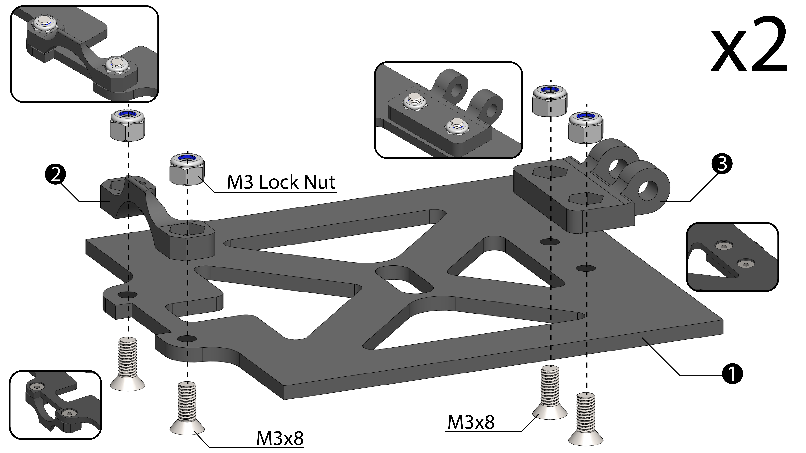 

## Step 2

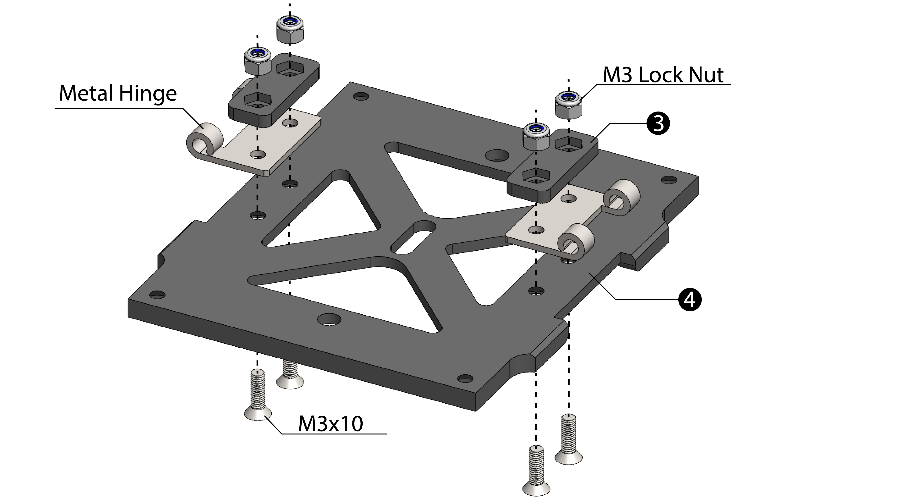 

## Step 3

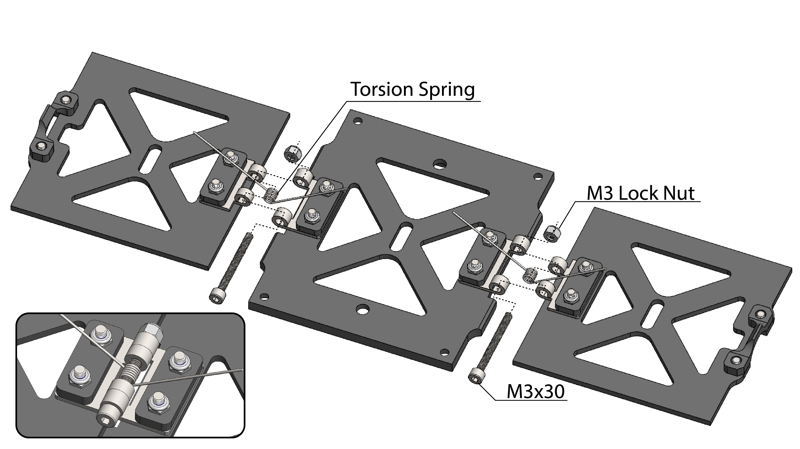 

## Step 4

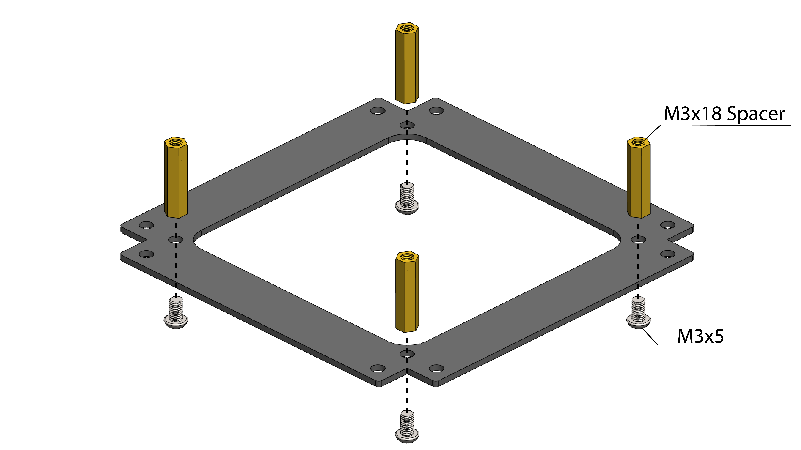 

## Step 5

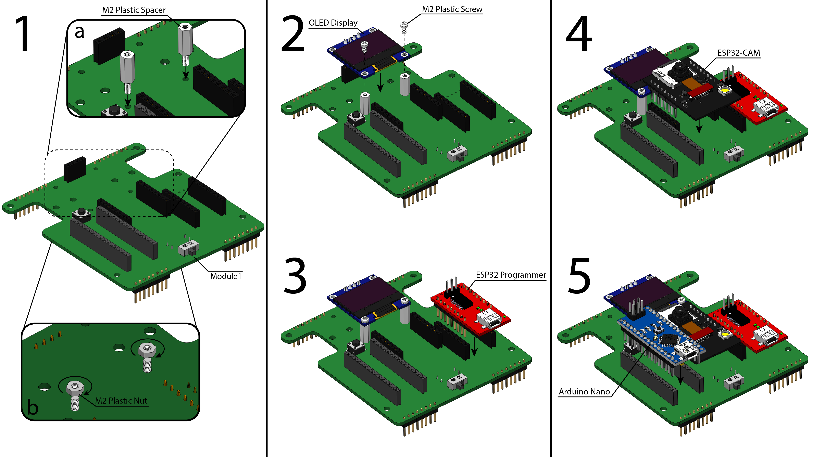 

## Step 6

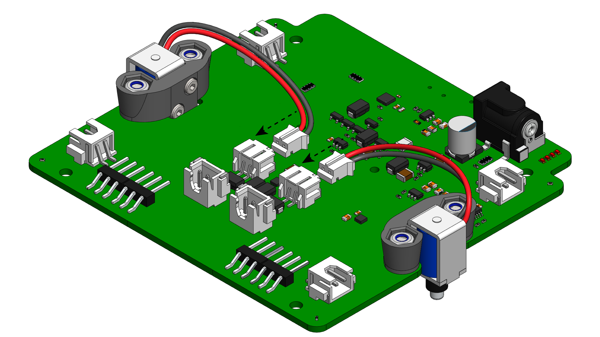 

## Step 7

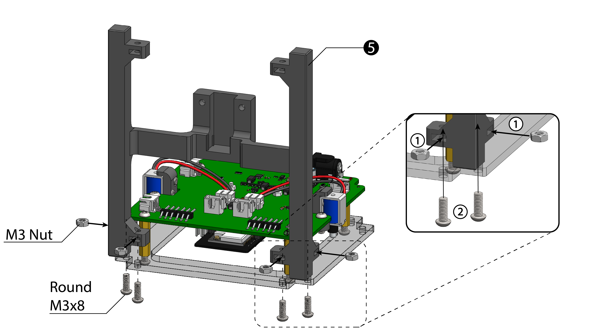 

## Step 8

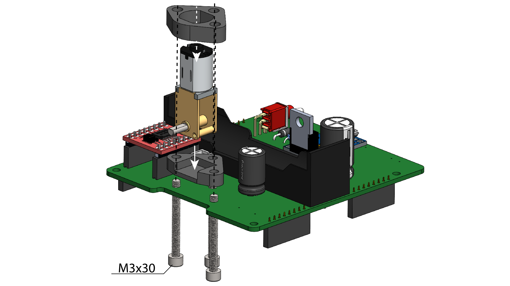 

## Step 9

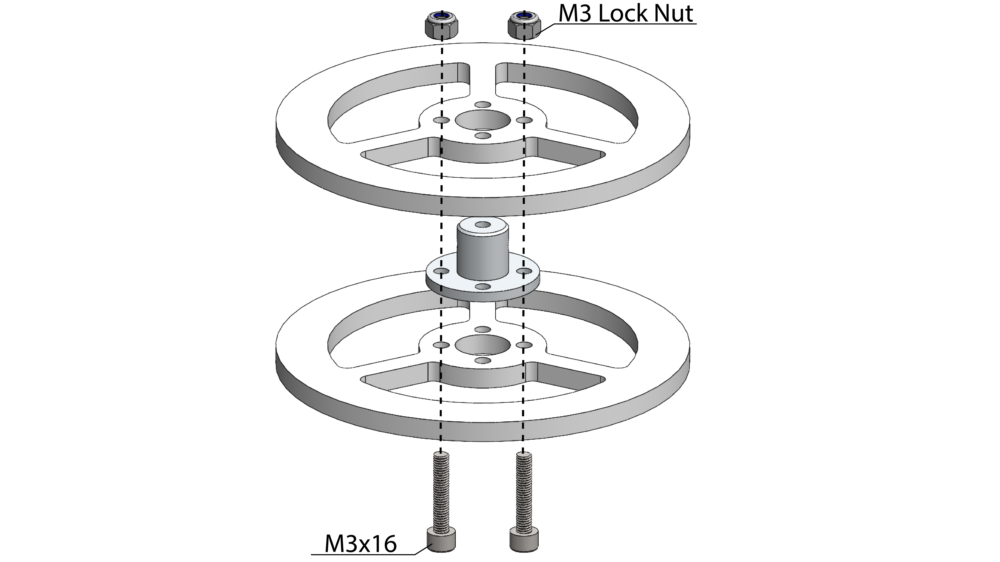 

## Step 10

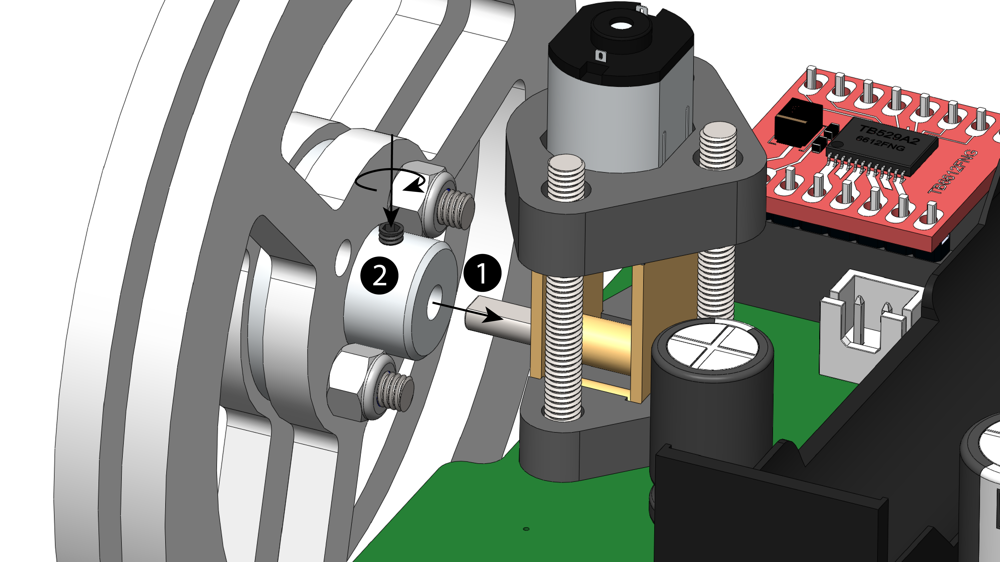 

## Step 11

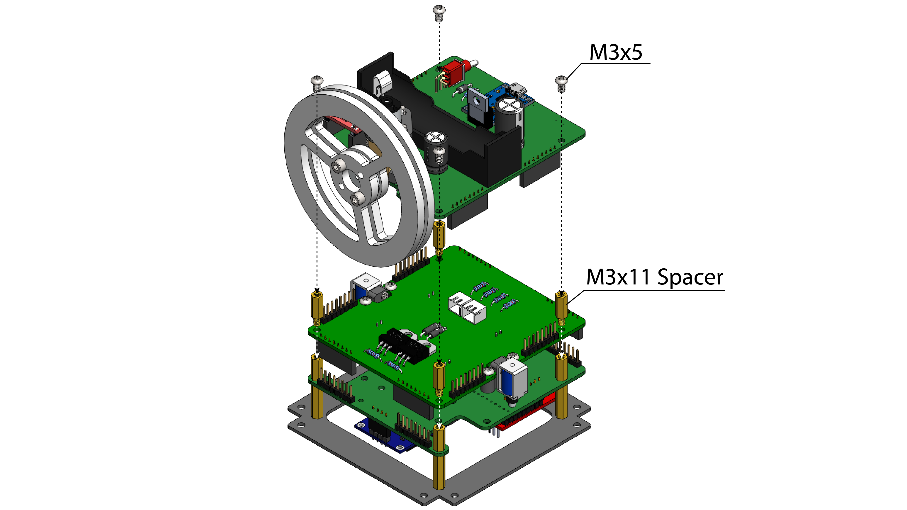 

## Step 12

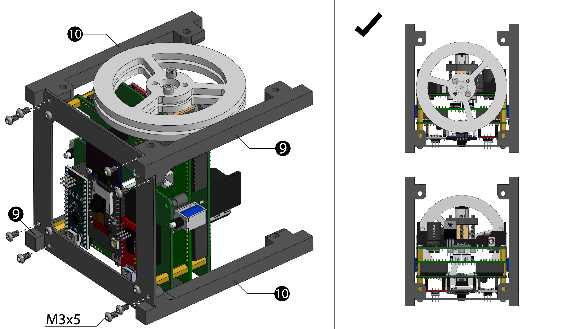 

## Step 13

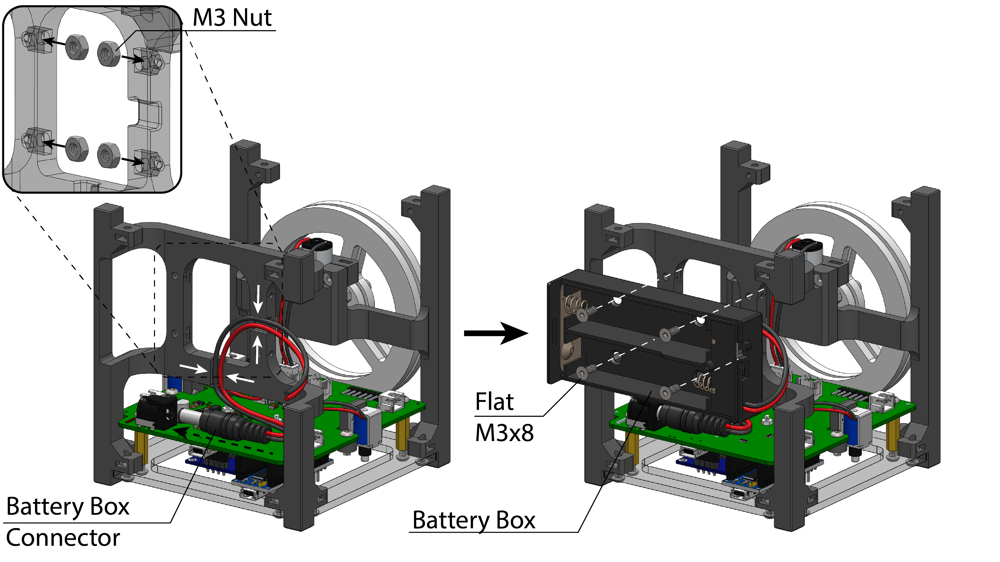 

## Step 14

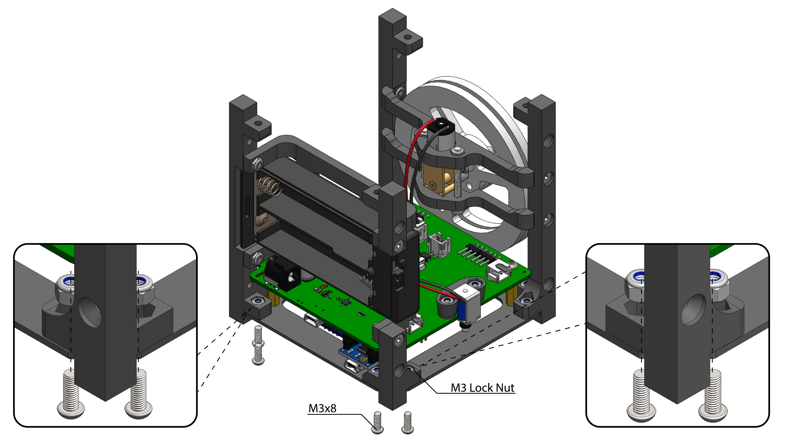 

