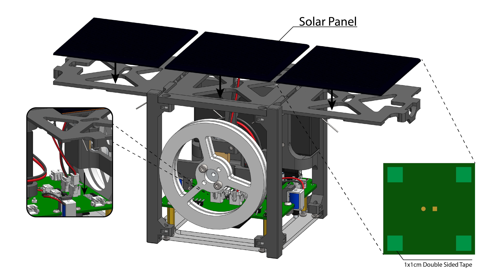
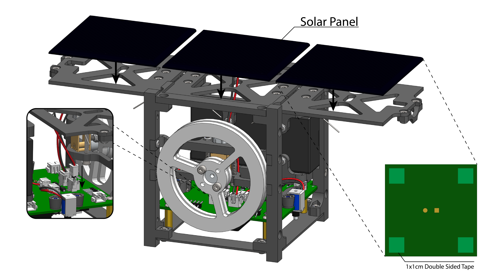

# CubeSat Assembly Instructions

## Step 1

## Step 2

## Step 3

## Step 4

## Step 5

## Step 6

## Step 7

## Step 8

## Step 9

## Step 10

## Step 11

## Step 12

## Step 13

## Step 14

## Step 15

## Step 16
