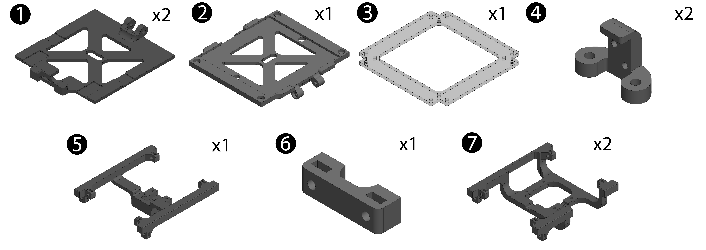
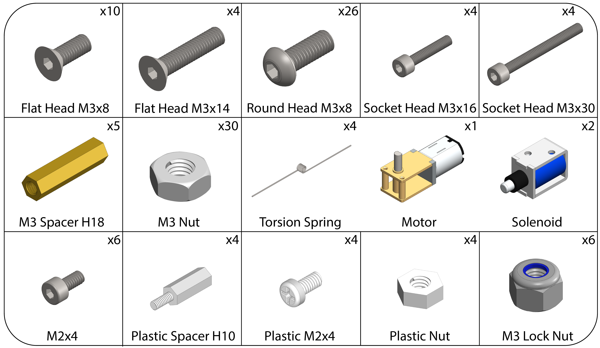

# CubeSat Kit Checklist
- ## Parts

- ## Components Box
    - Components of each cell in the box:

- ## Electronics
    - ### Mainboard
    - ### ESP32-CAM
    - ### Arduino Nano
    - ### OLED Display

- ## Tools Set
    - ### Hex Key: 1.5mm, 2.0mm, and 2.5mm
    - ### Mini Cross Screwdriver
    - ### Wrench: 5.5mm

- ## Solar Panel x 3

- ## Reaction Wheel Parts

- ## Battery 18650 cell x 2

- ## Battery USB Charger

- ## Battery Power Box

- ## Light Sensor With Wire and Header x 4

- ## Mini USB Wire

- ## Spare 3D Printed Parts

- ## Double Sided Tapes 