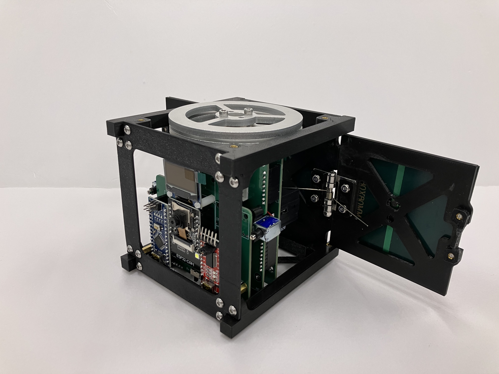

# OASA-CubeSat

 
 

## 1. Overview
OASA-CubeSat is an educational satellite designed to imitate the most stucture and functions of a CubeSat, which is a cubic miniature satellite with the size of 10x10x10cm. This CubeSat is a single 18650 3.6V battery powered device controlled by two microcontrollers: Arduino Nano and ESP32-CAM. It consists of one 12V geared DC motor for rotating the reaction wheel and two 5V solenoid actuators for deploying the solar panels. The CubeSat also contains a camera with a maximum resolution of 1600 x 1200. With our software uploaded to the microcontrollers, the camera live feed is able to transmit to and view it on the PC through its connected WiFi network. The electronics are all connected through our custom PCB boards which are stacked within the CubeSat’s 3D printed structure.

This repository contains the instructions of how to assemble the CubeSat, guidelines of how to upload the included source code to the CubeSat, and the STL files of the 3D printed parts for replacement of the broken parts or customization.  

## 2. Assembly
Before assembling the CubeSat, check if anything in the kit is missing with the list below: 
- [OASA-CubeSat Kit Checklist](Docs/Checklist.md)

To assemble the CubeSat, follow the instructions below:
- [CubeSat Assembly Instruction](Docs/Assembly.md)

For printing the 3D printed parts with your own printer, check out the STL files in the [STL](STL/) to load the 3D models in your slicer.

## 3. Software
The source code of this CubeSat is located in the folder: [Software](Software/). Follow the tutorial below to see how to upload the software and operate the CubeSat:
- [Software Upload and CubeSat Operation](Docs/Software.md)

## 4. Copyright
**Copyright © 2023 Orion Astropreneur Space Academy (Hong Kong) Ltd.** 

The intellectual property of this educational CubeSat belongs to Orion Astropreneur Space Academy (Hong Kong) Ltd. All rights reserved.

## 5. Maintenance
For any technical issues, please contact Anson Mak with ansonmak1997@gmail.com.